_After recently getting into guitars, I quickly discovered the world of effects, but also how expensive this hobby can be! I had also recently purchased a Raspberry Pi 4 that was sitting around waiting for my next project inspiration to come along._

After finding a tutorial by Anthony Tippy _@Tibbbbz_ demonstrating how a Raspberry Pi could be used to generate effects, I thought I’d have a crack at it too! You can view his great tutorial for yourself here: [https://medium.com/@atippy83/guitarix-the-pi-dle-board-8d6298ca8e42](https://medium.com/@atippy83/guitarix-the-pi-dle-board-8d6298ca8e42)

The steps and materials that I used below are the bare minimum required to get something like this working with little technical knowledge. This tutorial is aimed at beginners, however it would be good to be familiar using the Terminal on a Linux system.

----

## Materials

- 1x Raspberry Pi (I had a version 4, with 4 GB of RAM);
- 1x microSD card for your Raspberry Pi;
- 1x power supply for your Raspberry Pi;
- 1x audio (input / output) to USB dongle, or USB DAC (I used the Audio-Technica ATR2x-USB); and
- 1x 6.5 mm to 3.5 mm jack adaptor (only one required if you just want to listen via headphones, two if you want to plug the output in somewhere else).

I purchased my Raspberry Pi 4 in kit form, meaning it came with a power supply and an ample-sized microSD card with an OS already installed, along with a few other handy accessories such as a case and heatsinks.

----

## Step 1: Setup your Raspberry Pi

The first important step is to ensure that your microSD card gets an OS installed on it. I recommend using the Raspberry Pi Imager tool that can be found from their official website here: [https://www.raspberrypi.org/software/](https://www.raspberrypi.org/software/)

I installed the most recent version of Raspberry Pi OS, a port of Debian. This is maintained well and comes with a standard desktop.

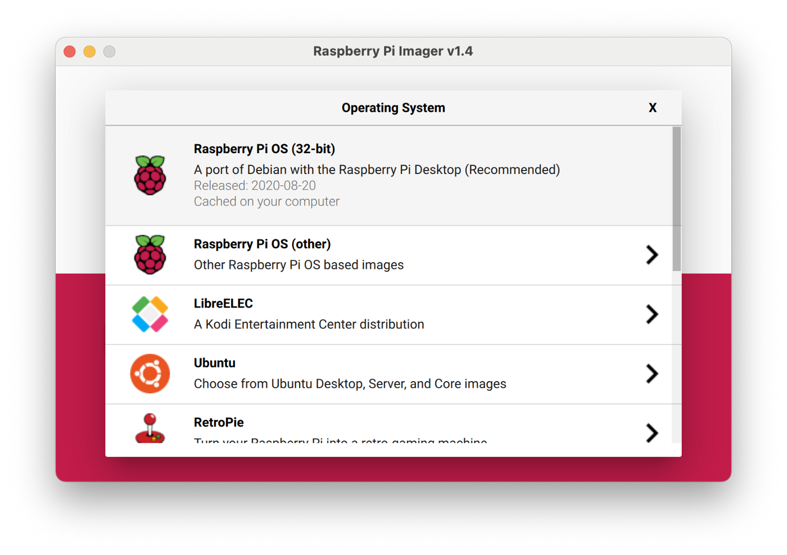

After installing the OS to the microSD, the Raspberry Pi can be connected to power and booted up. After configuring settings and updating software, your Raspberry Pi should be good to go:

## Step 2: Setup your USB audio

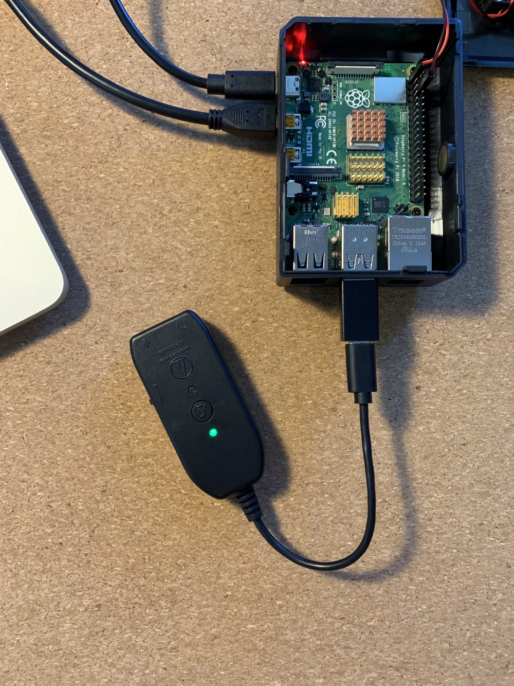

This step is the most problem-prone, so don’t be dissuaded if a bit of trouble-shooting is required to get this working out of the box.

The USB DAC should be plugged into one of the free USB ports on the Raspberry Pi, shown in the image on the left. This DAC has two jacks: audio in (mic), audio out (headphone).

We will be setting this DAC up such that guitar input will be sent via the mic audio input, and output will be sent via the headphone audio output on the DAC.

The next part of this step involves some configuration in the software of the Raspberry Pi in order to set the USB DAC to be the default audio card, succeeding the onboard 3.5 mm jack on the side of the board.

The first thing you want to do is to check that your USB DAC has been recognised by your Raspberry Pi. To do this, you will need to open up a _Terminal_ and enter the following commands:

`aplay -l` : This command lists all of the audio devices associated with the Raspberry Pi that are capable of audio playback.

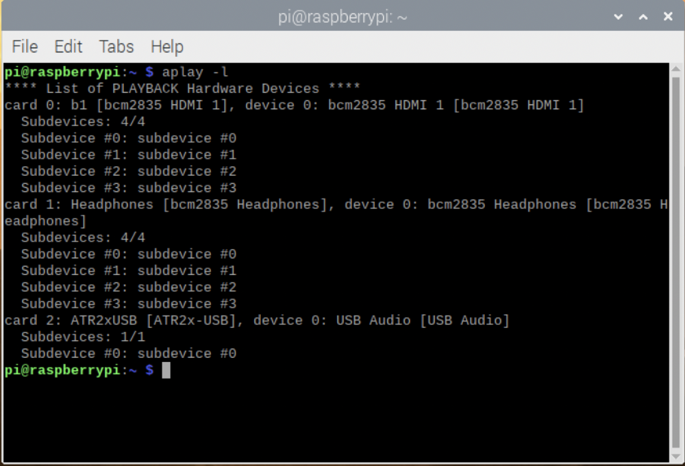

The output of this command is shown on the left. If all is well, you should see your USB audio listed usually as the second or third “card”, my USB audio card in this case is card 2.

This may be different for you, so make sure you double check what card number this is.

Make a note of your card number as you will need it later on in order to set it as the default audio card.

`arecord -l` : This command lists all of the audio devices associated with the Raspberry Pi that are capable of audio capture. This is will handle the input from your guitar.

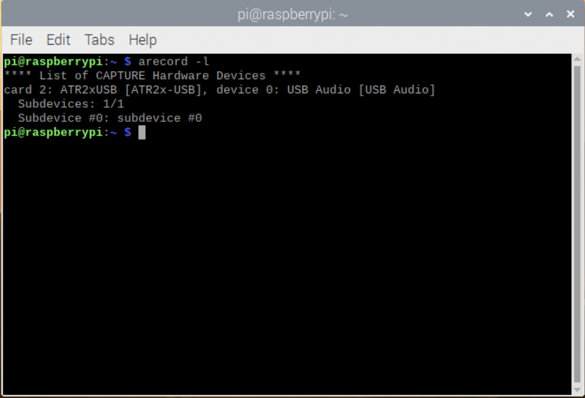

The output of this command is shown on the left. If all is well, you should see your USB audio card as the only listed device.

The number of this card should be the same as the number you made note of after running `aplay -l`.

Next, we need to edit a configuration file that controls the ALSA audio drivers running on the Raspberry Pi. This will tell the Raspberry Pi what the default audio card will be.

Run the command `sudo nano /usr/share/alsa/alsa.conf` in your Terminal instance, you may have to enter your user account password first. You will be presented with a view like this:

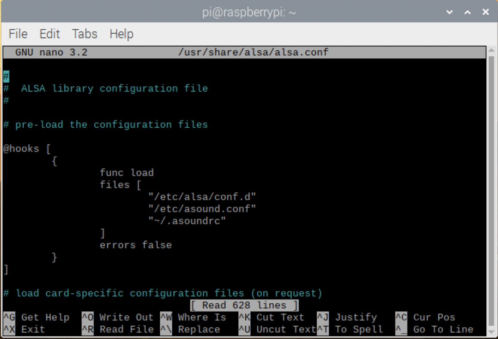

Next, you want to scroll down a bit further in the file (using “up” and “down” arrows) until you reach the following lines:

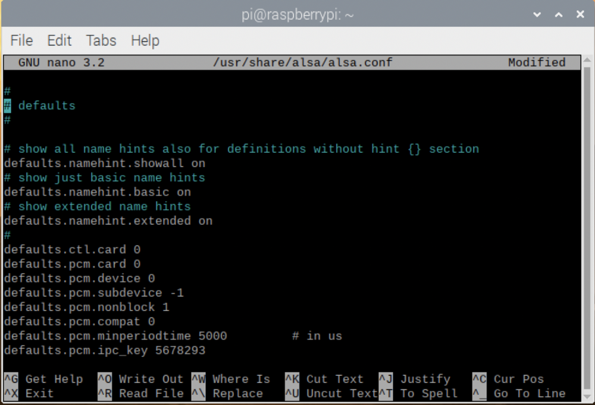

The lines of interest here are `defaults.ctl.card 0` and `defaults.pcm.card 0`. The `0` at the end of the lines refer to the card number that is acting as the default audio card.

Given that we know we want a specific card to act as the default audio card (in my case it was 2, use the number you noted before), this is the number that we want to put at the end of these two lines.

The lines should now read `defaults.ctl.card #` and `defaults.pcm.card #` replacing `#` with your card number. An example for a card number of 2 is below:

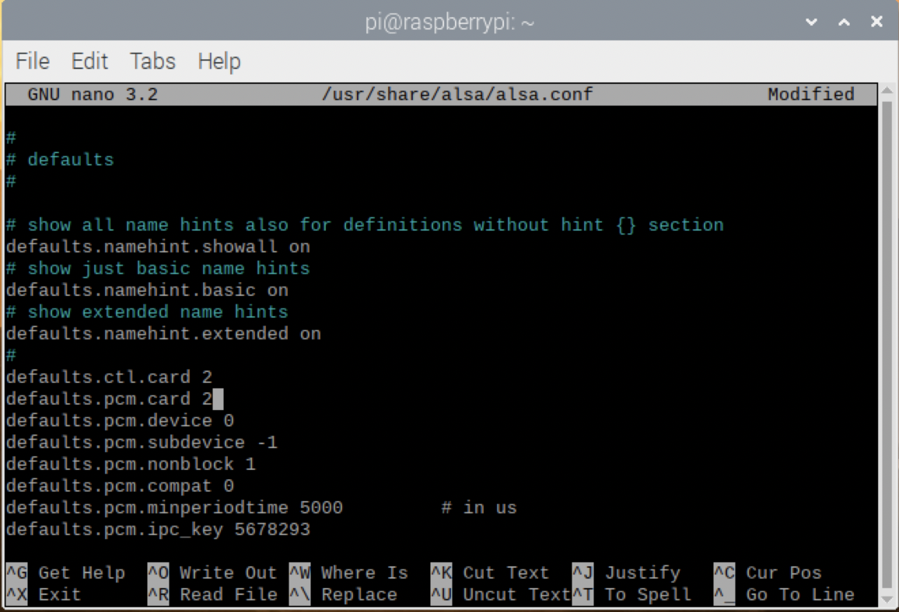

To exit this view, press `CTRL + x`, `y`, then `ENTER`.

Reboot your Raspberry Pi, and you can now move on to configuring the effects software.

## Step 3: Install effects software

I used the free and open-source _Guitarix_ software package in my project. There are other alternatives such as _Rakarrack_, but I haven’t looked into them yet!

If you navigate to the _Add / Remove Software_ menu item under _Preferences_ when you click the Raspberry Pi logo in the top left, you should be presented with a dialog box like the following:

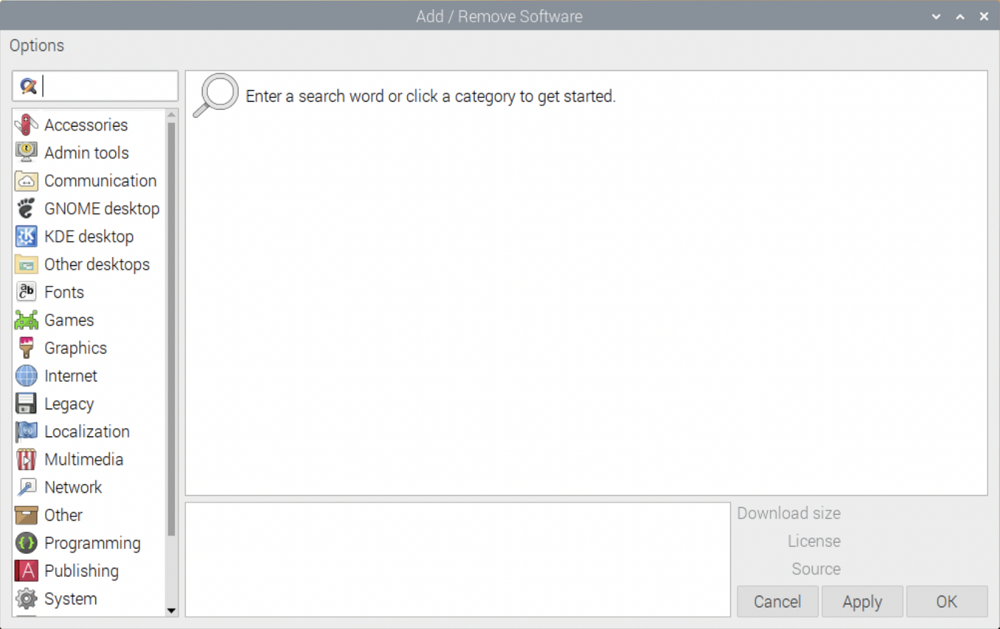

Using the top-left search box, search for `guitarix`.

Select the checkbox next to the package with version similar to `guitarix-0.xx.x-x` and click the “Apply” button in the bottom-right of the window. You will be prompted for your password before the software is then installed.

After the software has installed, Guitarix should appear in the Raspberry Pi menu under the _Sound & Video_ category. Click the option to start Guitarix.

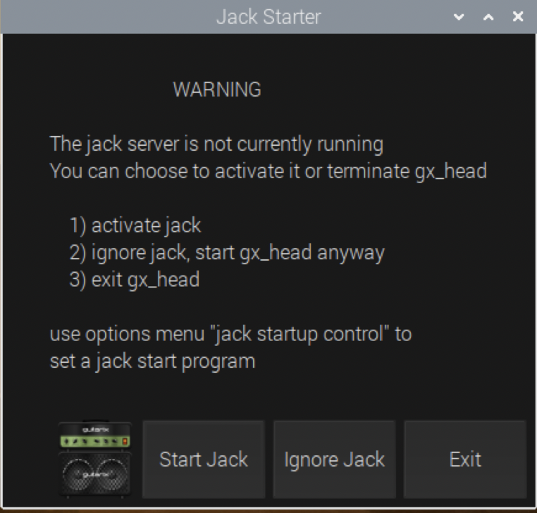

You will most likely be presented with this window, click “Start Jack” to continue.

You should see two windows open up: _JACK Audio Connection Kit_ and _Guitarix_.

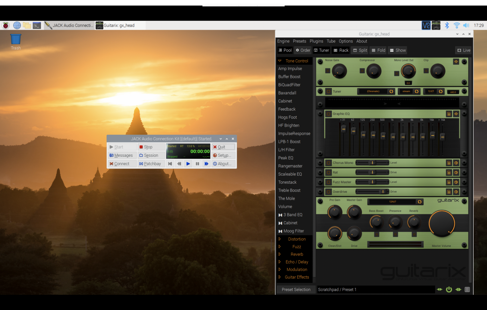

## Step 4: Configuring JACK

Before being able to get any sound in or out of Guitarix, the JACK software must be configured correctly. JACK essentially provides an abstraction allowing you to wire up your FX and Amp audio inputs and outputs when using a tool such as Guitarix.

In the JACK window, click “Setup”. You should be presented with the following window:

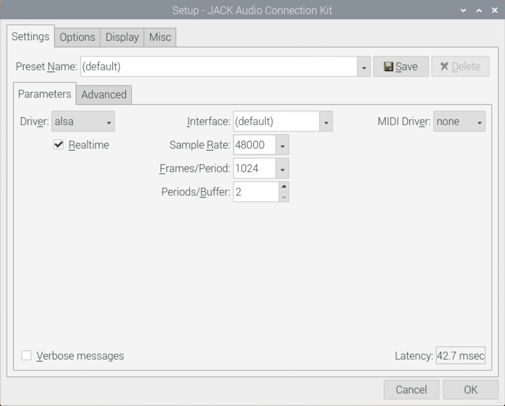

The key values you want to change are “Interface” and “Sample Rate”. Firstly, change “Interface” to point to your USB sound card.

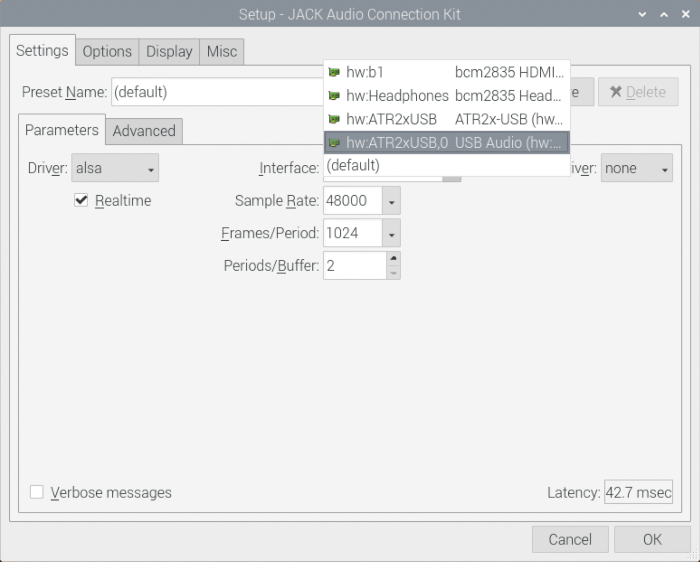

After you have selected the correct interface, set the sample rate to 44100. This is to give your Raspberry Pi a bit of breathing room, it is a powerful little unit, but it isn’t THAT powerful!

Your JACK settings should look similar to the following:

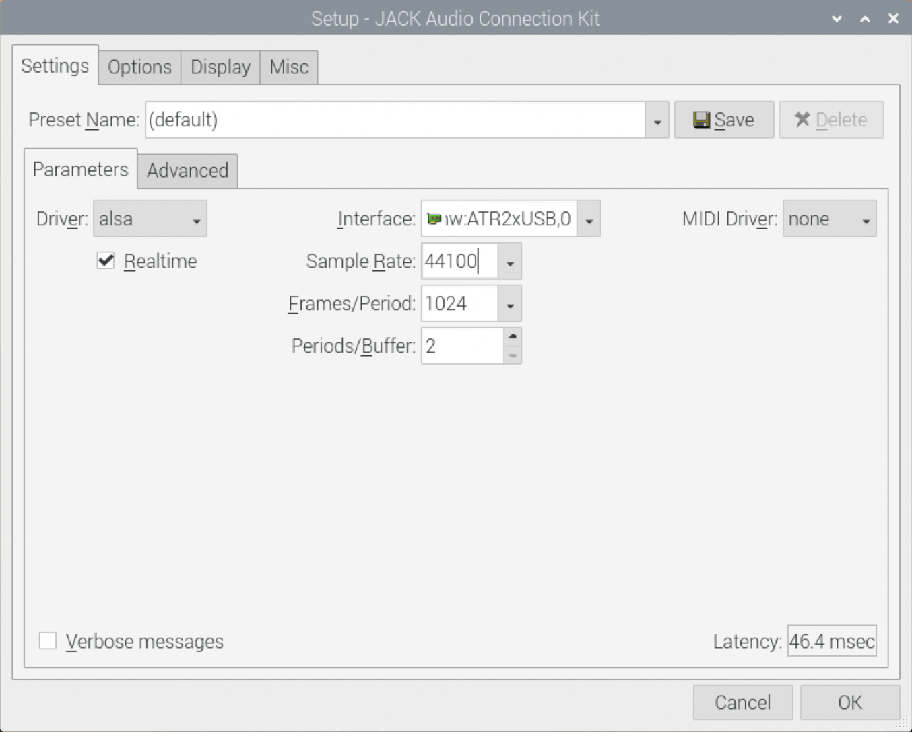

Finally, you can wire up all the connections. Close the setup window and click “Connect”. Using the “Connect” button and selecting the two ports of interest, wire up the input and output ports like so:

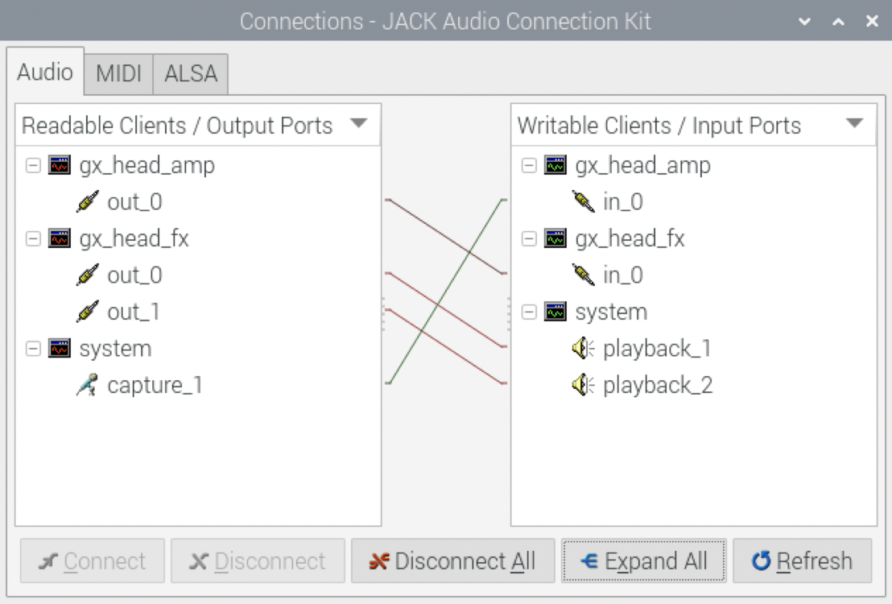

`capture_1` under `system` is the input from your guitar. `playback_1` and `playback_2` under `system` are the outputs to your headphones.

## Step 5: Play around

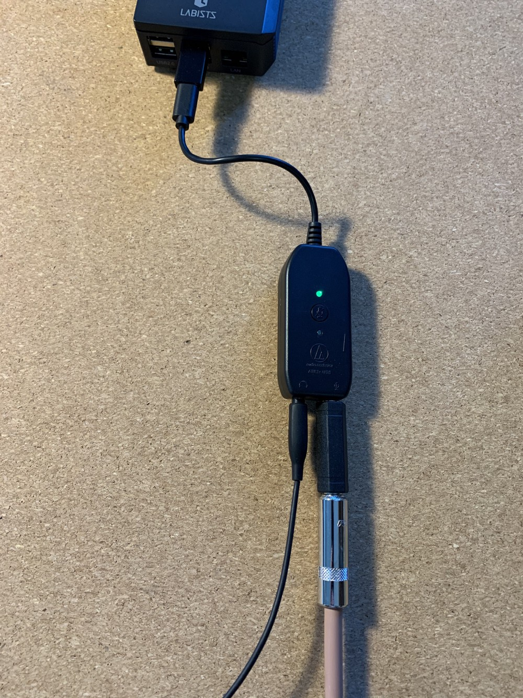

If all has gone well, you should now be able to plug in your guitar (using the 6.5 mm to 3.5 mm adaptor) into the microphone input and your headphones into the headphone output of your USB DAC.

Guitarix should now start responding to input, and hopefully you hear some output! If you don’t hear any output, double-check that any volume controls on your USB DAC have been set correctly and that you haven’t muted the microphone (if your USB DAC is like mine).

Volume adjustments of inputs and outputs can be done by running the command `alsamixer` in your Terminal.

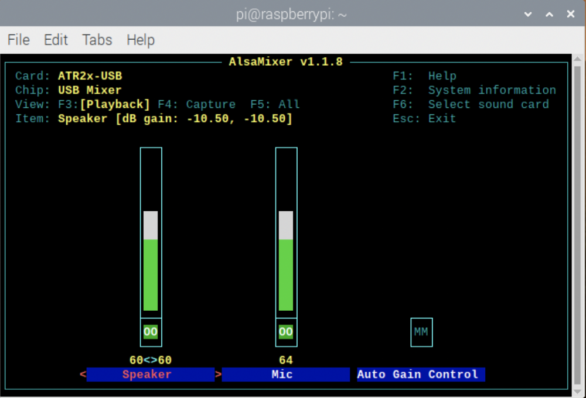

You may need to press `F6` and select your USB audio card before you see the correct volume sliders. To adjust your output (headphone) volume, press `F3` and then use your “up” and “down” arrows to adjust the volume accordingly. To adjust your input (guitar) volume, press `F4` and then use the arrows again.

You may need to play around with these levels until you are comfortable with what you are hearing. Don’t forget the volume on your guitar too!

Congratulations! Have fun with your new effects.

## Issues & Improvements

While this project is a quick and easy way to get started with guitar effects using a Raspberry Pi, there are a few big issues that I haven’t covered. I plan to continue this tutorial as a bit of a series and show you a few improvements that I plan to make.

The first main issue (the one I plan to attack first) is the latency between playing your guitar physically and hearing the adjusted output in your headphones. The tutorial I mentioned in my introduction actually did address this, and I recommend if you are keen to get on top of the latency to go and try out some of the suggestions there. The first one I’m going to attempt is overclocking the Raspberry Pi.

Future improvements that I plan to implement include:

- VNC access so I can use my MacBook to change Guitarix settings.
- External buttons to iterate through presets. Guitarix provides keyboard shortcuts for this already, but it is definitely neater to use buttons.
- Volume knobs that adjust the input and output volume.
- Two output ports, one to headphones, the other to an amp.

Please reach out if you have any issues or feedback!
